summary: Build a reproducible, layout-aware, XBRL-validated parsing pipeline for SEC 10-K filings, versioned with DVC.
id: lantern-case-study-1
categories: data-engineering
tags: dvc, pdf-parsing, ocr, xbrl, docling
environments: Web
status: Draft
authors: BigDataIA Fall 2026 Team 1
feedback link: https://github.com/BigDataIA-Fall-26-Team-1/lantern/issues

# Project lantern: Parsing SEC Filings into a Traceable Corpus

## Overview
Duration: 0:04:00

**Project LANTERN turns SEC 10-K filings into a corpus where every sentence and every number can be traced back to a page and a bounding box in the source, and every financial figure is checked against the filing's own XBRL.**

FinTrust Analytics' analysts download filings by hand and cannot say where a number in a memo came from. LANTERN automates the whole path: it downloads two Apple (AAPL) 10-K filings (FY2024 and FY2025) from SEC EDGAR, renders them to PDF, extracts text, tables and layout with three independent methods, validates the numbers against XBRL, evaluates quality against a hand-typed answer key, and versions every artifact with DVC, so the corpus rebuilds from one command.

### Results at a glance

| | Result | Step |
|---|---|---|
| **Corpus** | 2 filings, 121 pages, 1,705 validated records, each with a page and a bounding box | Parts 0, 5 |
| **Text accuracy** | 1.91% word error rate (pdfplumber) on 18 hand-typed pages across all six page types | Part 9 |
| **Table accuracy** | cell F1 of 1.0 on 111 cells keyed by two people independently (agreement 0.991) | Part 9 |
| **Validated against XBRL** | 456 of 456 statement numbers match the filing's own XBRL (100%); Docling 450 of 452 | Part 11 |
| **Build vs buy** | open source about $6 a year in compute vs about $4,540 a year for AWS Textract, at 5,000 filings | Parts 7, 10 |
| **Reproducible** | a fresh clone rebuilds everything with `dvc pull`; `dvc repro` skips every stage; 65 tests pass | Part 8 |

### What Project Lantern does

| Component | How it works |
|---|---|
| **Ingest** (Part 0) | Downloads the two 10-Ks pinned in `params.yaml` with `sec-edgar-downloader`, unpacks the iXBRL files, and renders each filing to PDF with Playwright (60 and 61 pages). |
| **Text** (Part 1) | Reads every page's text and word boxes with pdfplumber. A three-signal trigger sends image-only pages to Tesseract OCR: none of the 121 filing pages needed it, and the scanned test fixture came back at 95.4–95.7 confidence. |
| **Tables** (Part 2) | A hybrid extractor picks the best Camelot method per page (stream for the income statement, network for the balance sheet) and normalizes every number: negatives in parentheses, the "in millions" scale, unscaled per-share rows. |
| **Layout** (Part 3) | LayoutParser finds the blocks on each page and routes each one to the right extractor; a fallback keeps every word the model misses. |
| **Docling** (Part 4) | A second, independent parsing path: exact on tables (cell F1 1.0), used as a cross-check of the statements and for form-like pages. |
| **Corpus** (Parts 5–6) | 1,705 records, each validated by a pydantic schema and carrying its page and bounding box. JSONL is the source of truth; section Markdown, with a provenance comment before every block, feeds retrieval. |
| **Build vs buy** (Part 7) | AWS Textract runs as an optional, cached fallback, off by default, so the pipeline needs no cloud credentials. |
| **App** | A Streamlit UI over a read-only FastAPI backend on AWS EC2: browse every page with its layout blocks, and trace any number to its page, bbox, JSONL record and Markdown line. |
| **Pipeline** (Part 8) | The brief's nine DVC stages plus `parse_fixtures`, with every output hash in `dvc.lock`, data on a public-read S3 remote, and a CI smoke test on every pull request. |
| **Evaluation** (Part 9) | Scores every path against 18 hand-typed pages in six strata and two double-keyed statements, with regression tests that fail when a parser breaks. |
| **Benchmarks** (Part 10) | Times every stage per page and turns that into a yearly cost, open source vs managed. |
| **XBRL validation** (Part 11) | Loads the filings' own XBRL with Arelle (875 unique facts per filing), maps each table row to its concept, and checks every number. |

### Team

**Big Data and Intelligent Analytics (DAMG 7245), Fall 2026 · Team 1**

| Team member | Parts |
|---|---|
| **Pradyumna Reddy Cherla** | Part 2 (tables), Part 3 (layout), Part 9 (evaluation), Part 11 (XBRL validation) |
| **Pranav Avinash Waghmare** | Part 0 (download and render), Part 4 (Docling), Part 8 (pipeline), Part 10 (benchmarks) |
| **Preksha Praveen** | Part 1 (text and OCR), Part 5 (schema and provenance), Part 6 (formats), Part 7 (build vs buy), DVC remote on S3 |

### Links

- **Repository:** [github.com/BigDataIA-Fall-26-Team-1/lantern](https://github.com/BigDataIA-Fall-26-Team-1/lantern)
- **Deployed app:** [http://52.15.107.141:8501/](http://52.15.107.141:8501/)
- **Demo video:** TODO

## Architecture
Duration: 0:03:00

Every stage reads one folder and writes the next, and every folder is versioned with DVC.

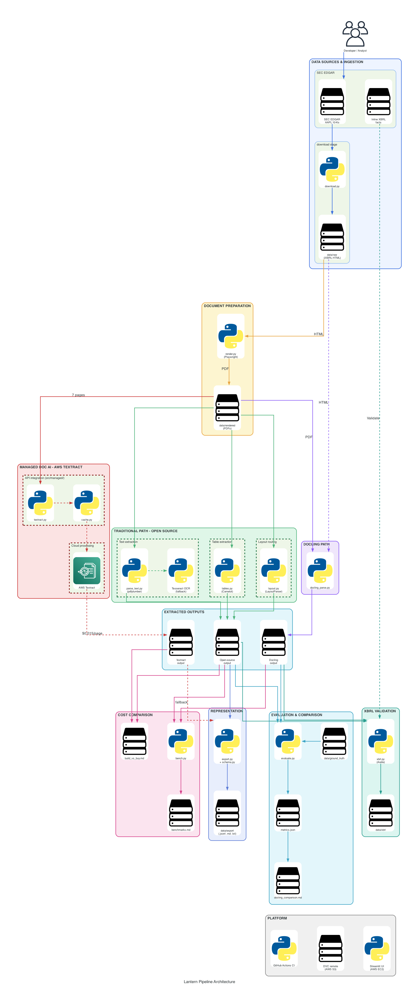

| Layer | Stages | What it produces |
|---|---|---|
| Ingest | `download`, `render` | the filings' iXBRL HTML (`data/raw`) and rendered PDFs (`data/rendered`) |
| Parse | `parse_pdfplumber`, `tables`, `layout`, `parse_docling` | text and word boxes, tables, layout blocks, and Docling's alternative reading |
| Managed fallback | (optional, off by default) | cached AWS Textract responses (`data/managed`) |
| Represent | `export` | validated JSONL, section Markdown and TXT (`data/export`) |
| Validate and evaluate | `xbrl`, `evaluate` | XBRL match rates (`data/xbrl`) and quality metrics (`reports/metrics.json`) |

## Setup and reproduction
Duration: 0:10:00

This rebuilds the whole corpus from our DVC remote. No AWS or other cloud credentials are needed: the data is publicly readable, and the managed service (Part 7) is off by default.

### Prerequisites

- Python 3.11
- System packages: Tesseract, Poppler (and Ghostscript if Camelot asks for it)
- Chromium for Playwright (only needed if you re-run the `render` stage)

macOS:

```bash
brew install tesseract poppler
```

Ubuntu / WSL:

```bash
sudo apt-get install -y tesseract-ocr poppler-utils
```

### Reproduce the corpus

These are the exact commands from the brief's reproducibility contract:

```bash
git clone https://github.com/BigDataIA-Fall-26-Team-1/lantern.git lantern && cd lantern
git checkout submission
python -m venv .venv && source .venv/bin/activate
pip install -r requirements.txt
dvc pull
dvc repro
dvc metrics show
pytest -q
```

### What you should see

- `dvc pull` downloads every data folder from the read-only S3 remote: `data/raw`, `data/rendered`, `data/parsed`, `data/tables`, `data/layout`, `data/figures`, `data/docling`, `data/export`, `data/managed`, `data/ground_truth`, `data/xbrl` and `data/bench`.
- `dvc repro` reports every stage as unchanged and skips it, because every output already matches `dvc.lock`. That is what reproducibility looks like.
- `dvc metrics show` prints the evaluation metrics from `reports/metrics.json` (Part 9).
- `pytest -q` passes every test.

<aside class="positive">
The managed service stays off: <code>managed.enabled: false</code> in <code>params.yaml</code>. The pipeline only reads its cached responses, so no cloud account is needed.
</aside>

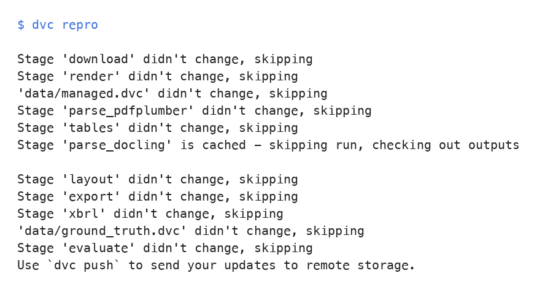

## Part 0: Download and render
Duration: 0:05:00

Two stages turn EDGAR filings into the PDFs every later stage reads.

### Download

`src/download.py` uses `sec-edgar-downloader` with `download_details=True`. Which filings to fetch is pinned in `params.yaml`, so the corpus never depends on "the latest" filings:

```yaml
download:
  ticker: AAPL
  forms: ["10-K"]
  after: "2024-01-01"
  before: "2026-01-01"
```

Every request declares the team's User-Agent (name and Northeastern email, also from `params.yaml`). Each filing's `full-submission.txt` is unpacked into an `unpacked/` folder with the original file names: the iXBRL `.htm`, the `.xsd` and the linkbases, which Part 11 needs to load the filing in Arelle.

### Render

EDGAR's official documents are Inline XBRL HTML, not PDFs, so `src/render.py` renders each filing's HTML with Playwright (headless Chromium, Letter size) to `data/rendered/{TICKER}_{FORM}_{PERIOD}.pdf`. `PERIOD` comes from the `CONFORMED PERIOD OF REPORT` header line, and the CIK from `CENTRAL INDEX KEY`. The stage also writes `data/rendered/manifest.csv` (stem, accession, cik, ticker, form, period, source file), which lets every later stage translate a file name into an accession number.

<aside class="negative">
Fonts and the browser engine move page breaks, and page breaks decide every page number downstream. The PDFs were therefore rendered once, on one machine, and everyone else gets them with <code>dvc pull</code>. Re-rendering elsewhere would shift pages.
</aside>

### Run it

```bash
dvc repro download render
```

After a `dvc pull`, both stages are skipped. To inspect the results:

```bash
du -sh data/raw
cat data/rendered/manifest.csv
pdfinfo data/rendered/AAPL_10K_20250927.pdf | grep Pages
```

### Results

| Filing | Accession | Rendered PDF | Pages |
|---|---|---|---|
| FY2024 10-K | 0000320193-24-000123 | `AAPL_10K_20240928.pdf` | 60 |
| FY2025 10-K | 0000320193-25-000079 | `AAPL_10K_20250927.pdf` | 61 |

`data/raw` is 37.3 MB (181 files), under the brief's 100 MB limit.

### Test fixtures

Three small PDFs are committed to Git in `tests/fixtures/` (not DVC), because CI has no access to the DVC remote:

| Fixture | What it is | Used to test |
|---|---|---|
| `statement.pdf` | FY2025 PDF page 32, the income statement | table extraction |
| `scanned.pdf` | FY2025 pages 5–7 rasterized at 300 DPI (`pdftoppm`) and rebuilt as an image-only PDF (`img2pdf`) | the OCR path |
| `multicol.pdf` | JPMorgan Chase 10-K (accession 0000019617-25-000270), PDF page 10: Apple's filings have no multi-column page | reading order |

Their sources are documented in `tests/fixtures/README.md`.

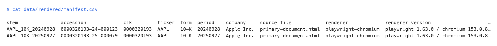


## Part 1: Text extraction with OCR fallback
Duration: 0:08:00

The `parse_pdfplumber` stage reads every rendered PDF page by page. For each page it saves the text, saves every word with its bounding box, and decides whether the page needs OCR.

### What the stage writes

| Output | Contents |
|---|---|
| `data/parsed/{stem}_p{NNNN}.txt` | Text of one page |
| `data/parsed/{stem}.words.jsonl` | One word per line with `bbox` in PDF points, top-left origin |
| `data/parsed/ocr_log.csv` | One row per page: document, page, triggered, reason, engine, mean confidence, and the three signal values |

### The OCR trigger

The trigger checks three signals on every page: the character count, the share of junk tokens such as `(cid:NN)`, and how much of the page is covered by images. The `reason` column in the log records which signals fired. All thresholds, the OCR resolution and the Tesseract settings live in `params.yaml`:

```yaml
ocr:
  min_chars: 50
  junk_ratio: 0.3
  dpi: 300
  image_coverage: 0.6
  tesseract_config: "--oem 1 --psm 6"
```

Tesseract returns boxes in pixels. The stage converts them back to points (`pt = px * 72 / dpi`) so OCR words and pdfplumber words use the same coordinates.

### Run it

On the full corpus:

```bash
dvc repro parse_pdfplumber
```

On the committed fixtures only (the same command CI runs):

```bash
python src/parse_text.py --input tests/fixtures --output /tmp/parsed_fixtures
```

### Check the results

Every page has a `.txt` file:

```bash
pdfinfo data/rendered/AAPL_10K_20250927.pdf | grep Pages
ls data/parsed/AAPL_10K_20250927_p*.txt | wc -l
```

| Filing | PDF pages | `.txt` files | Pages sent to OCR |
|---|---|---|---|
| AAPL_10K_20250927 | 61 | 61 | 0 |
| AAPL_10K_20240928 | 60 | 60 | 0 |

A word record from `words.jsonl`:

```json
{"doc_id": "0000320193-25-000079", "stem": "AAPL_10K_20250927", "page": 1, "text": "UNITED", "bbox": [255.33, 67.76, 303.71, 80.75], "units": "pt", "origin": "top-left", "source": "pdfplumber", "ocr": false, "conf": null}
```

The OCR log for the fixtures (the `sed` fills empty cells so `column` keeps them aligned):

```bash
sed 's/,,/,-,/g' /tmp/parsed_fixtures/ocr_log.csv | column -s, -t
```

| Fixture | Page | Triggered | Reason | Engine | Mean conf | Text chars |
|---|---|---|---|---|---|---|
| scanned | 1 | True | low_chars; image_coverage | tesseract | 95.4 | 3,808 |
| scanned | 2 | True | low_chars; image_coverage | tesseract | 95.7 | 6,108 |
| scanned | 3 | True | low_chars; image_coverage | tesseract | 95.5 | 4,565 |
| statement | 1 | False | none | pdfplumber | n/a | 1,194 |
| multicol | 1 | False | none | pdfplumber | n/a | 3,846 |

The scanned fixture has no text layer (0 characters, full-page image), so every page goes to Tesseract and comes back with non-empty text. The born-digital fixtures and all 121 pages of the two filings stay on pdfplumber.

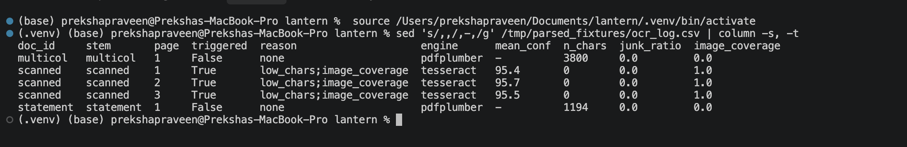

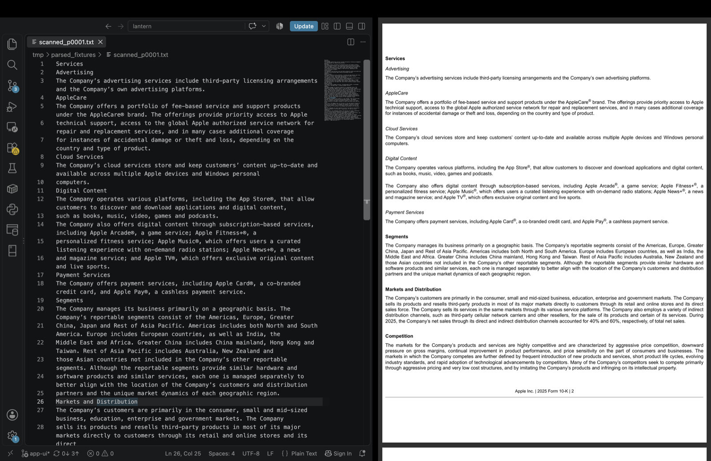

<aside class="positive">
Rendered EDGAR PDFs almost never need OCR, so the scanned fixture is the only real test of the OCR path. That is why it is committed to Git and run in CI.
</aside>

## Part 2: Tables and the hybrid extractor
Duration: 0:08:00

The `tables` stage finds the financial statements in each filing, extracts them with the best method for each page, and normalizes every number.

### Finding the statement pages

A page counts as a statement page when a statement title is (nearly) a whole line near the top of the page and the page has enough numbers. Two problems on the real filings were fixed: the Item 15 exhibit index was a false positive (fixed by limiting extra characters on the title line), and the short comprehensive income statement was missed (fixed by lowering the minimum number count to 20). The result is exactly pages 32 to 36 in both filings, with no false positives.

### The bake-off

Five methods on two statement pages, with 10 cells per method checked by hand against the page image:

| Method | Income statement (p32) | Balance sheet (p34) |
|---|---|---|
| Camelot lattice | 0/10 | 0/10 |
| Camelot stream | **10/10** | 5/10 (stopped at "Total assets") |
| Camelot network | 0/10 (dropped every row label) | **10/10** |
| Camelot hybrid | 0/10 | 0/10 |
| pdfplumber text | 9/10 (dropped a closing parenthesis) | 10/10 (but split labels mid-word) |

Two findings drive the design:

1. **Camelot's accuracy score ranks the methods almost backwards.** Lattice and hybrid scored 100 on both pages yet got 0/10: accuracy measures how cleanly text fits into cells, not whether the structure is right.
2. **No single method wins every statement.** Stream wins the income statement, network wins the balance sheet.

### The hybrid extractor

`src/tables.py` decides per page, with every threshold in `params.yaml` under `tables`:

1. **Clean** the table: drop empty rows and columns and `$`-only columns, and join labels that wrap onto a second line.
2. **Choose an order:** ruled pages try lattice first; borderless pages (all of Apple's statements) try stream first.
3. **Check the structure:** minimum size, coverage of the page's numbers, and no values merged into the label column.
4. **Score** each valid table (`accuracy − whitespace_weight × whitespace`) and accept the first one at or above `accept_score` (80); otherwise keep the best valid table as `best_below_threshold`.

Every decision is logged in `tables_log.csv`. On the balance sheet, stream is tried first and rejected (coverage 40%), then network is accepted (score 87.95).

| Page | Statement | Method chosen | Shape | Score |
|---|---|---|---|---|
| 32 | Income | stream | 27×4 | 90.38 |
| 33 | Comprehensive income | stream | 16×4 | 87.21 |
| 34 | Balance sheet | network | 39×3 | 87.95 |
| 35 | Shareholders' equity | stream | 23×4 | 91.36 |
| 36 | Cash flows | stream | 38×4 | 91.88 |

### Normalization

Raw and normalized grids are stored side by side (`.raw.csv` and `.norm.csv` in `data/tables/`):

- `(1,234)` becomes −1,234; dashes become 0; `$`, commas and trailing footnote markers are stripped.
- The scale comes from the caption. For Apple, money rows are × 1,000,000, share counts × 1,000, and per-share amounts stay unscaled.
- Each row is tagged `header`, `money`, `shares` or `per_share`.

Checked on the income statement: net income 112,010 becomes 112,010,000,000; (321) becomes −321,000,000; diluted EPS stays 7.46. On the balance sheet, total liabilities 285,508 plus total shareholders' equity 73,733 equals total assets 359,241. 25 unit tests in `tests/test_tables_normalize.py` cover the rules.

### Run it

```bash
dvc repro tables
python src/tables.py --input tests/fixtures --output /tmp/tables_fixture
```

The full bake-off, the 20 hand-checked cells and the reasoning are in `reports/tables_method.md`.

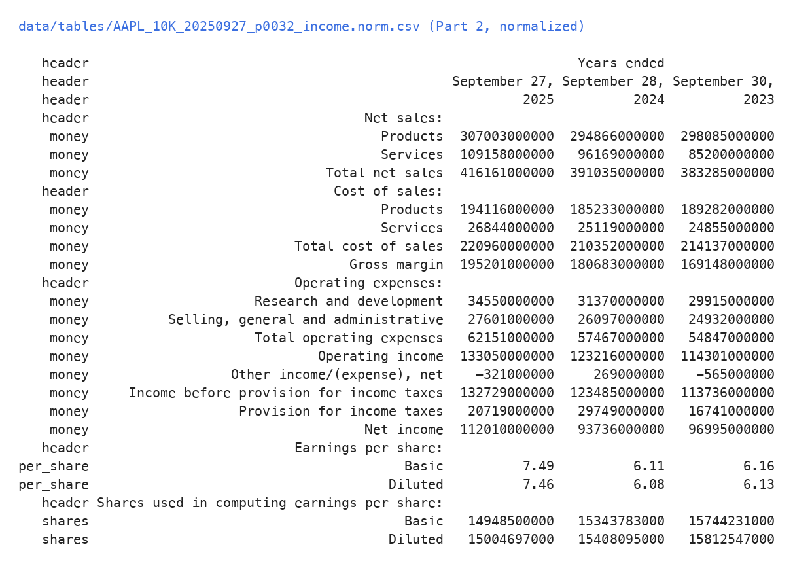

## Part 3: Layout detection and routing
Duration: 0:06:00

The `layout` stage finds the blocks on every page with a learned layout model, then sends each block to the right extractor.

### The model

LayoutParser EfficientDet (`tf_efficientdet_d0`, trained on PubLayNet), with pages rendered at 150 DPI and boxes converted to PDF points with a top-left origin. The score threshold is 0.25: at 0.5, almost nothing was kept, since most correct blocks scored 0.28 to 0.45.

### Routing

| Block type | Sent to |
|---|---|
| Text, Title, List | pdfplumber within the block's box (OCR if empty) |
| Table | Part 2's extractor, limited to the block's padded region |
| Figure | cropped to `data/figures/` |

Blocks are put in reading order (by column, then top to bottom), and each Text block is attached to the nearest preceding Title as its section. Output: `data/layout/{stem}.blocks.jsonl`.

Routing helps tables directly: on the balance sheet, Camelot stream on the full page stopped at "Total assets" (coverage 40%), but stream limited to the layout region returned the whole statement (37×3, coverage 90%).

### Audit on 10 pages

Ten FY2025 pages covering every page type (cover, table of contents, prose, MD&A, statements, notes, auditor's report) were checked element by element:

| Class | Elements | Correct | Partial | Missed | Wrong type | Detected |
|---|---|---|---|---|---|---|
| Text | 60 | 26 | 5 | 28 | 1 | 52% |
| Title | 38 | 26 | 0 | 11 | 1 | 68% |
| List | 4 | 2 | 0 | 2 | 0 | 50% |
| Table | 8 | 5 | 0 | 3 | 0 | 63% |

PubLayNet was trained on journal articles, not SEC filings, and it shows: it finds the statements reliably but misses about half the body text. The stage handles that rather than losing text:

- **Missed text:** words in no block become `fallback` Text blocks, so no text is lost.
- **Clipped boxes:** words near a box's edge snap into it (40 pt for tables, 15 pt for text). This removed about 30% of fallback blocks, the one- or two-word fragments that broke sentences.
- **Duplicates and false tables:** boxes mostly covered by better boxes are dropped, and a Camelot result must lie inside the requested region.

### Full run

| | FY2024 | FY2025 |
|---|---|---|
| Blocks (after cleanup) | 871 | 834 |
| Tables detected by the model | 29 | 31 |
| Tables extracted (accepted or best below threshold) | 23 | 24 |

### Run it

```bash
dvc repro layout
```

QA overlays for the audited pages, in both filings, are in `reports/layout/`; the per-page audit is in `reports/layout_audit.md`.

**Where it works:** on the FY2025 income statement (page 32), one tight Table box covers the whole statement, so Camelot gets exactly the right region. Only the statement title above it is missed.

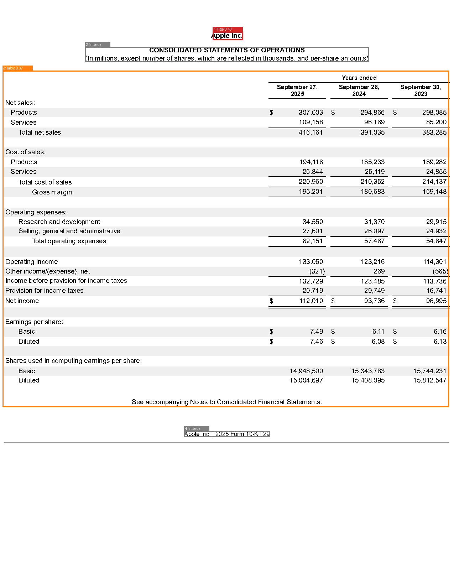

**Where it fails:** on the FY2025 cover page (page 1), the model draws a page-wide Table box (score 0.25) and a page-wide Figure box (score 0.38), and labels the Nasdaq column a List. This is PubLayNet's domain shift: it was trained on journal articles, not SEC cover pages. No text is lost, though: the cover's words still reach the corpus through the fallback blocks.

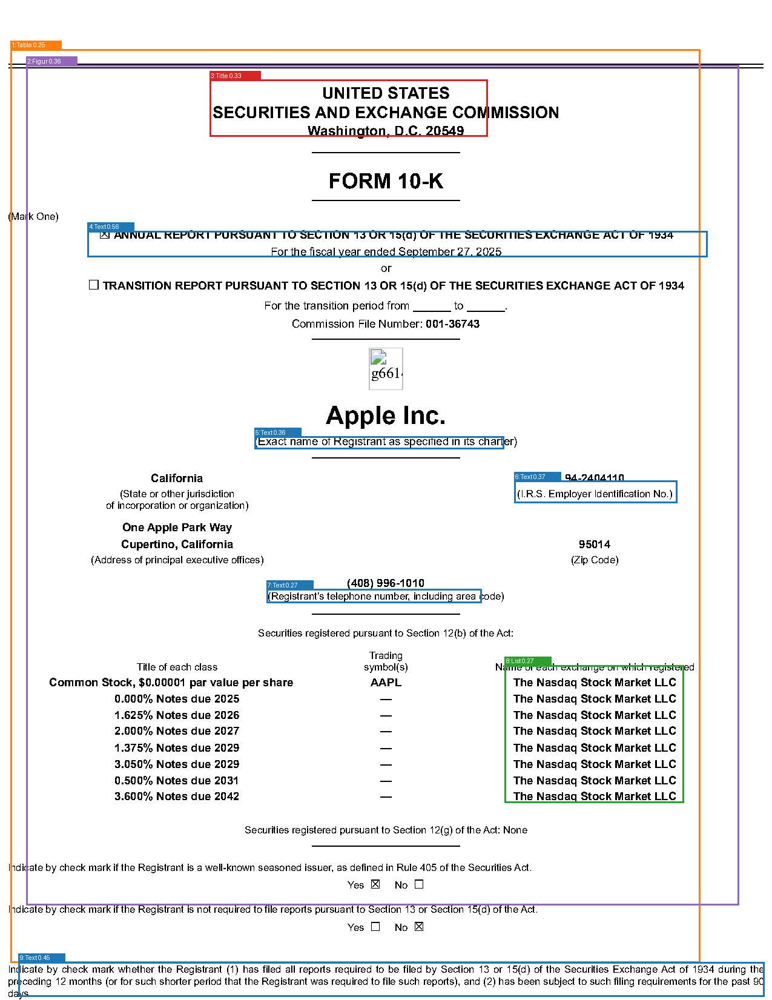

<aside class="negative">
Recommendation from the audit: keep PubLayNet for table routing, where it is reliable, and rely on the fallback for text coverage. Part 4 tests whether Docling's layout model closes the text-recall gap.
</aside>

## Part 4: Docling path and comparison
Duration: 0:08:00

The `parse_docling` stage converts every rendered PDF with Docling, as an alternative path next to the traditional one (not a replacement).

### What it writes

`src/docling_parse.py` writes to `data/docling/`: Markdown, lossless JSON, every table as CSV, per-page Markdown (`export_to_markdown(page_no=n)`, which Part 9 needs for WER), and `{stem}.items.jsonl`. It must be run as a module, `python -m src.docling_parse`, as its DVC stage does: running the file directly fails, because its name shadows Docling's own `docling_parse` package.

Docling writes bounding boxes with a bottom-left origin. `items.jsonl` holds one record per item with boxes converted by `bbox.to_top_left_origin(page_height)` to the schema's top-left origin in points, and every comparison uses this file. The lossless JSON is kept exactly as Docling wrote it.

Setup: Docling 2.134.0, `do_ocr: false`, TableFormer `accurate` (from `params.yaml`).

### Run it

```bash
dvc repro parse_docling
```

### Comparison, using the metrics of Parts 9 to 11

| Dimension | Metric | Traditional | Docling |
|---|---|---|---|
| Text accuracy | WER, 18 ground-truth pages | **1.91%** (pdfplumber) | 11.71% |
| Numeric fidelity (text) | numeric-token recall | **99.54%** | 83.18% |
| Table structure | cell F1, 2 tables, 111 cells | 1.00 | 1.00 |
| Numeric fidelity (statements) | XBRL match rate | **456 / 456 (100%)** | 450 / 452 (99.6%) |
| Reading order | WER, multi-column page | 7.62% pdfplumber, **3.15%** layout-routed | 9.60% |
| Reading order | WER, cover pages | **3.74%** pdfplumber, 59.87% layout-routed | 6.90% |
| Scanned pages | WER, scanned fixture | **0.00%** pdfplumber + OCR | 100% (no text, `do_ocr: false`) |
| Throughput | s/page, p50 / p95 | **0.70 / 3.49** | 4.52 / 19.22 |
| Memory | peak RSS | **1,055 MiB** (layout stage) | 3,597 MiB |
| Cost | USD/year at 5,000 filings, p50 | **$5.63** | $36.35 |

Findings:

- **Text:** Docling's 11.71% WER has two measured sources: the scanned page, where it produced no text at all, and statement pages (9.87% vs 1.67%), where its per-page Markdown wraps rows in table syntax. On prose and notes the gap is small.
- **Scanned pages:** we run Docling without OCR, because no rendered EDGAR page needs it (0 of 121 pages triggered in Part 1). On the image-only fixture, Docling returns nothing, while the traditional path's OCR trigger fires and Tesseract recovers the text.
- **Reading order:** on the multi-column page, LayoutParser routing reads the columns in the right order (3.15%), better than both pdfplumber and Docling. On the cover, the result reverses: Docling (6.90%) is far better than layout routing (59.87%). Each of these strata has only 1–2 pages, so these are indications, not general results.
- **XBRL:** every number either path extracted matches XBRL. The difference is coverage: in both filings, Docling merged the first cash-flow row ("Cash, cash equivalents … beginning balances") into the column header. That is 6 printed numbers but 2 distinct XBRL facts, because each year's beginning cash is the previous year's ending cash, which Docling did capture. Hence 450 / 452.
- **Footnotes:** our filings have no footnotes (checked manually), so this dimension cannot separate the two paths.

### PDF vs HTML

The same filing (FY2024), converted from the original iXBRL HTML and from the rendered PDF in the same run (`data/docling/timing.csv`):

| | Rendered PDF | iXBRL HTML |
|---|---|---|
| Tables found | 51 | 63 |
| Conversion time | 965.9 s | 96.8 s |
| Pages and bboxes | yes (60 pages) | none |

HTML finds 12 more tables and converts 10× faster, because it skips the layout model and TableFormer. But it has no pages or boxes, so it cannot support the page-and-bbox citations the brief requires. It is useful as a cross-check of table content, not as the source of truth.

### Recommendation

Keep the **traditional pipeline as the primary path**: on 18 ground-truth pages it has the lowest WER (1.9% vs 11.7%) and the highest numeric recall (99.5% vs 83.2%), it matched XBRL on all 456 statement numbers including the cash-flow row Docling dropped, its OCR fallback handles scanned pages that Docling without OCR returns empty, and it costs about 6× less compute. Use **Docling as the fallback and cross-check**: as an independent second reading of statement tables (both paths agreed cell for cell, F1 1.00), and for pages with side-by-side fields like the cover, where it is far better than our layout routing. The full comparison is in `reports/docling_comparison.md`.

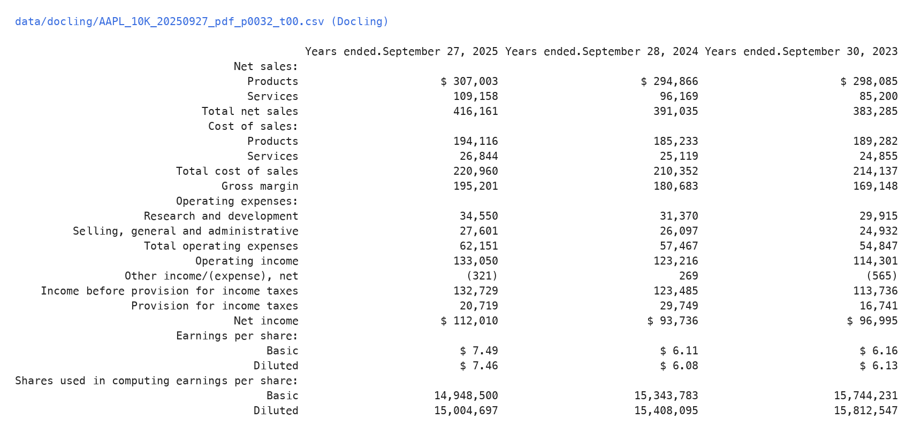

## Part 5: Metadata schema and provenance
Duration: 0:08:00

The `export` stage turns the traditional path's outputs (layout blocks routed through Parts 1 and 2) into one JSONL record per block, then rebuilds each section as Markdown.

### The schema

`src/schema.py` defines the Appendix B schema as a pydantic model (`"schema": "lantern/1.0"`). Every record is validated when it is written, so a bad field fails the stage that produced it.

| Field | Example from the FY2025 10-K | Source |
|---|---|---|
| `doc_id` | `0000320193-25-000079` | accession number, from `manifest.csv` |
| `company`, `cik`, `ticker`, `form` | `Apple Inc.`, `0000320193`, `AAPL`, `10-K` | `manifest.csv` |
| `fiscal_year`, `fiscal_period` | `2025`, `FY` | `dei:DocumentFiscalYearFocus`, `dei:DocumentFiscalPeriodFocus` |
| `page`, `block_id`, `block_type` | `1`, `p0001_b001`, `Table` | layout stage |
| `bbox`, `units`, `origin` | `[8.38, 39.0, 555.3, 762.93]`, `pt`, `top-left` | layout stage |
| `section` | Item heading, else nearest Title | export stage |
| `text`, `table` | block text, or `{columns, rows, raw_cells, scale}` | Parts 1 and 2 |
| `extractor`, `extractor_version` | `pdfplumber`, `pdfplumber 0.11.10` | the stage that produced the text |
| `ocr`, `ocr_conf` | `false`, `null` | Part 1 |
| `source_path`, `sha256` | `data/rendered/AAPL_10K_20250927.pdf`, file hash | the rendered PDF |

Each record also carries three fields beyond Appendix B: `detector` and `detector_score` (the layout model and its confidence for the block) and `figure_path` (the crop in `data/figures/` for Figure blocks).

### Run it

```bash
dvc repro export
```

### Check the results

One record, pretty-printed:

```bash
head -n 1 data/export/AAPL_10K_20250927.jsonl | python -m json.tool
```

The first record on page 1 is a cover-page block that the layout model (`tf_efficientdet_d0`) labelled `Table` with a score of 0.254. It carries no `table` object, and its text came from pdfplumber. This is the PubLayNet domain shift the tutorial warns about: the model was trained on journal articles, not SEC cover pages.

Keys are identical across all records in both filings. This prints a set with exactly one tuple of keys:

```bash
python -c "import json,glob; print({tuple(sorted(json.loads(l))) for f in glob.glob('data/export/*.jsonl') for l in open(f)})"
```

```text
{('bbox', 'block_id', 'block_type', 'cik', 'company', 'detector', 'detector_score', 'doc_id', 'extractor', 'extractor_version', 'figure_path', 'fiscal_period', 'fiscal_year', 'form', 'ocr', 'ocr_conf', 'origin', 'page', 'schema', 'section', 'sha256', 'source_path', 'table', 'text', 'ticker', 'units')}
```

Provenance in the Markdown. Every block is preceded by an HTML comment with the accession number, page and block id. A reader never sees it, but a chunker in Case Study 2 can keep it as metadata. Use single quotes here: in zsh, `!` inside double quotes triggers history expansion.

```bash
grep -n -A1 '<!--' data/export/AAPL_10K_20250927.md | head
```

```text
3:<!-- 0000320193-25-000079 p1 p0001_b001 -->
12:<!-- 0000320193-25-000079 p1 p0001_b002 -->
66:<!-- 0000320193-25-000079 p1 p0001_b003 -->
72:<!-- 0000320193-25-000079 p1 p0001_b004 -->
```

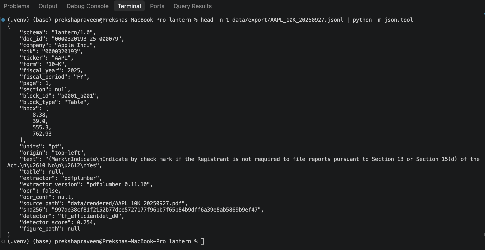

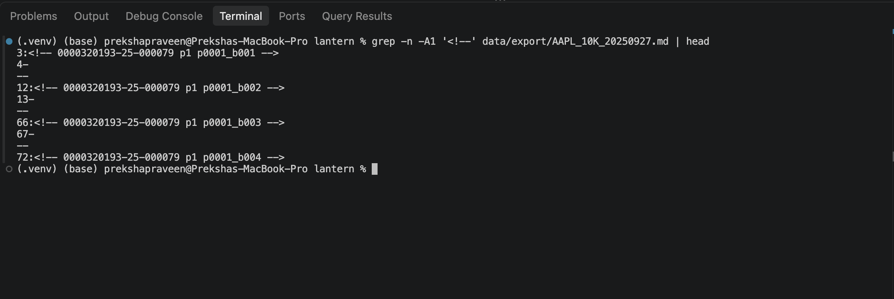

### Trace one number

Net income for FY2025 appears in the Markdown as a table row (values in millions, FY2025, FY2024, FY2023):

```bash
grep -n -i 'net income' data/export/AAPL_10K_20250927.md | head -5
```

```text
2591:| Net income | 112,010 | 93,736 | 96,995 |
```

The nearest provenance comment above that line names the block it came from:

```bash
awk 'NR<=2591 && /<!--/{c=$0} NR==2591{print c; exit}' data/export/AAPL_10K_20250927.md
```

```text
<!-- 0000320193-25-000079 p32 p0032_b003 -->
```

The matching JSONL record (selected fields):

```bash
python -c "import json; [print(json.dumps({k:r[k] for k in ('page','block_id','block_type','bbox','section','extractor')})) for r in map(json.loads, open('data/export/AAPL_10K_20250927.jsonl')) if r['block_id']=='p0032_b003']"
```

```json
{"page": 32, "block_id": "p0032_b003", "block_type": "Table", "bbox": [3.39, 95.22, 604.84, 548.43], "section": "Item 8", "extractor": "camelot-stream"}
```

So the number traces back to a Table block on page 32 of the rendered PDF, in Item 8 (Financial Statements), extracted with Camelot stream. The bbox covers the whole statement table, not the single row: provenance is stored per block.

To draw that box on the page:

```bash
python -c "import pdfplumber; pdf=pdfplumber.open('data/rendered/AAPL_10K_20250927.pdf'); pdf.pages[31].to_image(resolution=110).draw_rect((3.39, 95.22, 604.84, 548.43), stroke='red', stroke_width=3).save('docs/img/p5-bbox-highlight.png')"
```


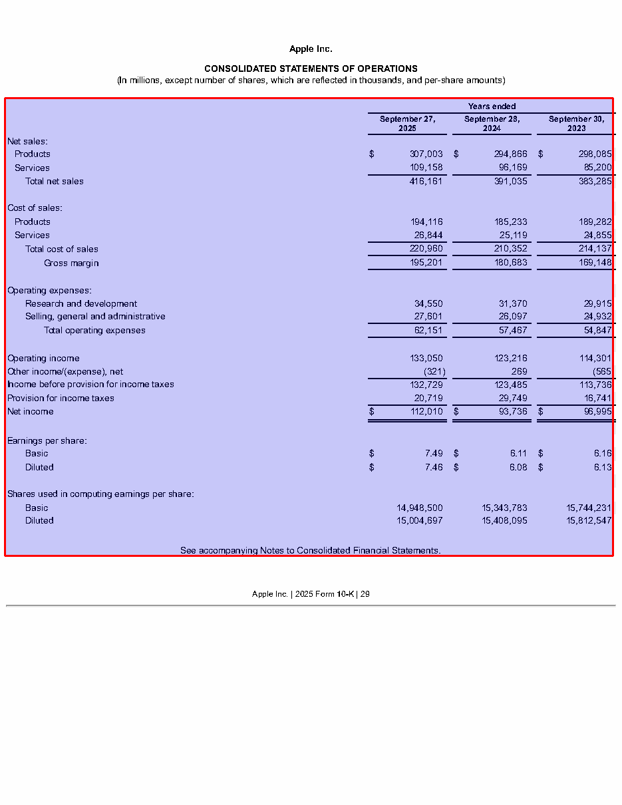

## Part 6: Storage formats
Duration: 0:06:00

The `export` stage writes every filing in three formats from the same validated records, so they never disagree about content. They differ only in what they keep.

| Role | Format | File |
|---|---|---|
| Source of truth | JSONL | `data/export/{stem}.jsonl` |
| Feeds Case Study 2 (retrieval and question answering) | Markdown, generated from the JSONL records and never edited by hand | `data/export/{stem}.md` |
| Baseline only | TXT | `data/export/{stem}.txt` |

### Measure size and token cost

```bash
python -m src.format_stats
cat reports/format_stats.csv
```

This writes `reports/format_stats.csv` and cuts a 4-page test slice (FY2025 PDF pages 31 to 34: the Item 8 heading, statement index, income statement, comprehensive income and balance sheet) into `reports/format_test/`. Tokens are approximated as characters / 4.

| Scope | Format | Bytes | Approx. tokens | vs TXT |
|---|---|---|---|---|
| FY2025 full filing | JSONL | 795,499 | 198,384 | 3.9× |
| | Markdown | 249,975 | 62,062 | 1.2× |
| | TXT | 207,509 | 51,446 | 1.0× |
| FY2024 full filing | JSONL | 811,191 | 202,352 | 4.0× |
| | Markdown | 248,304 | 61,669 | 1.2× |
| | TXT | 204,869 | 50,810 | 1.0× |
| FY2025 pages 31–34 | JSONL | 30,565 | 7,635 | 6.4× |
| | Markdown | 6,449 | 1,610 | 1.4× |
| | TXT | 4,771 | 1,190 | 1.0× |

JSONL costs about 4× the tokens of plain text for a whole filing, and 6.4× on statement pages, where every table is stored twice (raw and normalized) with its metadata fields. Markdown costs 20 to 40% more than plain text while keeping the Item headings, the tables and a provenance comment before every block.

### Ask the same three questions of each format

The same slice was given to the same model in a new chat per format, with a prompt that said to use only the document. Scoring rules were fixed before any answer was seen. Answers are recorded word for word in `reports/format_test/llm_answers.md`.

| Question | Tests | Correct answer |
|---|---|---|
| Q1. Net income in the latest fiscal year, and on which page? | provenance | $112,010 million; PDF page 32 (printed page 29) |
| Q2. "Other income/(expense), net" in fiscal 2023: income or expense? | sign, table structure | $(565) million, an expense |
| Q3. Which Item has the balance sheets; total assets at the end of fiscal 2025? | section, number | Item 8; $359,241 million |

| Format | Scored run | Where the Q1 page came from |
|---|---|---|
| JSONL | 3 / 3 | the `page` field, plus the footer record for the printed page |
| Markdown | 3 / 3 | the provenance comment `p32` |
| TXT | 2 / 3 + 1 partial | matching detached page numbers to statement titles by order; the answer changed between runs |

All three formats got every number and sign right. The difference is how well each answer is grounded: JSONL and Markdown gave the page from explicit markers, while TXT had to guess.

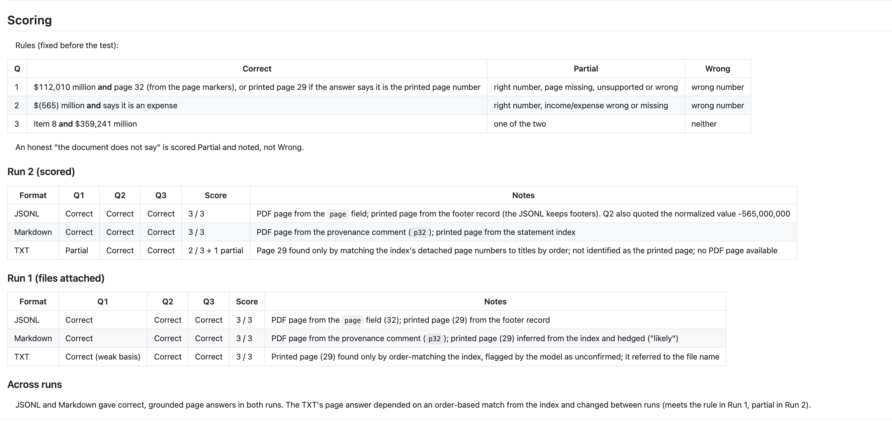

### The decision

JSONL is the source of truth. It is the only format that keeps every field (page, bbox, block id, extractor version, raw and normalized cells, sha256), and Part 11 and any Case Study 2 citation need those fields. At about 200,000 tokens per filing, it is too expensive as LLM context.

Markdown feeds Case Study 2. It answered as accurately as JSONL at about a fifth of the tokens on the slice, its `## Item` headings let text be split by section, and every block keeps its `<!-- doc_id pN block_id -->` comment, which leads back to the JSONL record and its bbox.

TXT is kept only as a baseline, to show what the structure in the other two formats is worth.

<aside class="negative">
Limits of this test: one model, two runs, one 4-page slice of statement pages, and lookup questions whose answers appear in all three formats. Token counts are characters / 4, not a real tokenizer. Full details are in <code>reports/format_decision.md</code>.
</aside>

## Part 7: Build vs buy with AWS Textract
Duration: 0:08:00

The same pages were sent through AWS Textract (`AnalyzeDocument` with `TABLES` and `LAYOUT`, region `us-east-1`): 7 of the 10 allowed pages. These were the FY2025 income statement (p32), the balance sheet (p34), the two tables that scored below `tables.accept_score` (p22, p47), and the three pages of the scanned fixture. Textract's output was mapped into the Part 5 schema and compared cell by cell with the open-source output.

### The fallback

```yaml
managed:
  enabled: false
  provider: aws-textract
  region: us-east-1
```

| Piece | What it does |
|---|---|
| `src/managed/fallback.py` | Called from `src/export.py` (tables) and `src/parse_text.py` (OCR). With `enabled: false` it reads cache hits and never calls the API |
| `src/managed/mapper.py` | Maps Textract responses into schema records (bbox from page fractions to PDF points, top-left; tables through the Part 2 normalizer) |
| `data/managed/` | The 7 raw responses, one JSON file each, keyed by a hash of (source PDF hash, page, provider, API, features) |
| `data/managed.dvc` | Tracks the cache with `dvc add`. It is a cache, not a stage output |

Every fallback decision is logged in `data/export/managed_fallback_log.csv` and `data/parsed/managed_fallback_log.csv`. Because the default is `enabled: false`, `dvc repro` runs without AWS credentials.

```bash
dvc pull data/managed.dvc
ls data/managed
```

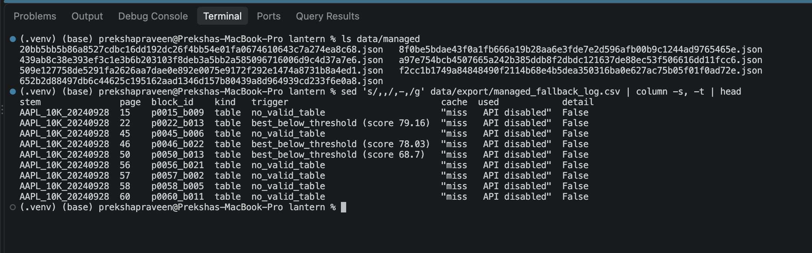

### Compare the two paths

No API calls are needed; both commands work from the cache:

```bash
python -m src.managed.mapper
python -m src.managed.compare
ls reports/managed/
```

**Statement tables, cell by cell:**

| Page | Open-source numeric cells | Textract numeric cells | Identical |
|---|---|---|---|
| FY2025 p32, income statement | 57 | 57 | 57 |
| FY2025 p34, balance sheet | 54 | 54 | 54 |

**OCR on the scanned fixture** (WER against the born-digital text of the same pages, after treating curly/straight quotes, dashes and ®/™/© as equal):

| Scanned page | Tesseract WER | Textract WER | Numbers correct | Confidence (Tesseract / Textract) |
|---|---|---|---|---|
| 1 | 0.000 | 0.004 | both 100% | 95.4 / 99.1 |
| 2 | 0.000 | 0.002 | both 100% | 95.7 / 99.8 |
| 3 | 0.002 | 0.004 | both 100% | 95.5 / 99.7 |

Textract reported higher confidence, but Tesseract was at least as accurate, so confidence thresholds have to be calibrated per engine.

**The two low-score tables the fallback replaced:**

| Page | Camelot (best attempt) | Textract | Values correct |
|---|---|---|---|
| p22, share repurchases | `camelot-network`, score 78.46: headers split over 6 rows, top header lines cut off | complete one-row headers | 11/11 both |
| p47, term debt | `camelot-stream`, score 72.69: an extra first row from the sentence above the table | no extra row, headers merged | 21/21 both |

The fallback fixed table structure, not numbers. A low Camelot score did not mean wrong values.

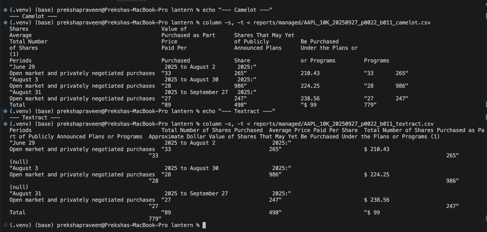

### Cost

From AWS's Textract pricing page (checked 2026-10-07): Tables at $0.015 per page for the first 1 million pages a month, with Layout free alongside Tables.

| Volume | Pages | Textract, Tables + Layout |
|---|---|---|
| Our corpus (2 filings) | 121 | about $1.82 |
| 5,000 filings a year, every page | about 302,500 a year | about $4,540 a year |
| 5,000 filings a year, fallback only | at most about 50,000 a year | at most about $750 a year |

### Data handling for client documents

Public 10-Ks are low risk, but client documents would need answers first: whether content is used for training (and an AI-services opt-out in AWS Organizations), which region stores it, how long it is kept and how to delete it, which compliance standards the client requires, and a least-privilege IAM role with keys kept out of the repo. Details are in `reports/build_vs_buy.md`.

### Recommendation

Keep the open-source pipeline as the primary path. Textract matched it number for number on every page compared, and its one measurable benefit was cleaner table structure on two tables whose numbers were already right. Keep Textract as the optional, cached fallback, off by default, and trigger it from a validation failure (an XBRL mismatch in Part 11) rather than from Camelot's score alone.

<aside class="negative">
Limits: seven pages, one company, one provider. The scan is a clean 300 DPI rasterization; degraded scans, where a managed service usually helps most, were not tested.
</aside>

## Part 8: DVC pipeline and CI
Duration: 0:08:00

Every step of the pipeline is a DVC stage in `dvc.yaml`, with its command, dependencies, parameters and outputs. `dvc.lock` records the hash of every output, so `dvc pull` gives anyone exactly our files, and `dvc repro` only re-runs a stage when its code, parameters or inputs change.

### The stages

The brief's nine canonical stages:

`download` → `render` → `parse_pdfplumber`, `tables`, `layout`, `parse_docling` → `export` → `xbrl` → `evaluate`

plus one extra stage, **`parse_fixtures`**, which runs every extraction path (pdfplumber with the OCR fallback, layout and Docling) on the scanned and multi-column fixtures, so Part 9 can score those two strata like the filing pages. The brief requires the nine names; extra stages are allowed.

Three folders are inputs rather than stage outputs, so they are tracked with `dvc add`:

| Pointer file | What it tracks |
|---|---|
| `data/managed.dvc` | the cached Textract responses (Part 7) |
| `data/ground_truth.dvc` | the hand-typed answer key (Part 9) |
| `data/bench.dvc` | the benchmark measurements (Part 10) |

Every threshold and setting lives in `params.yaml`, so changing one re-runs only the stages that read it.

```bash
dvc stage list
dvc dag
```

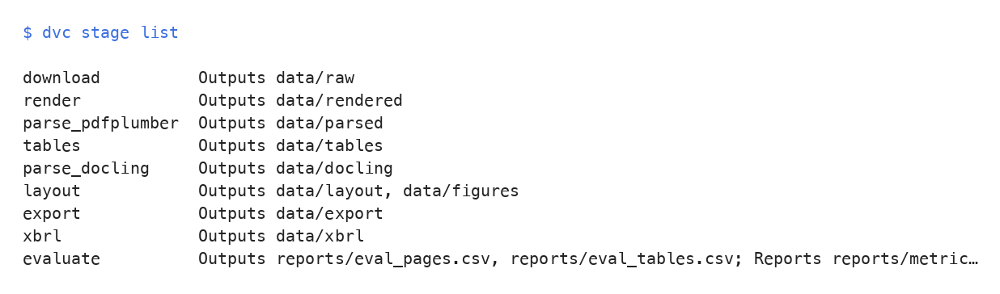

### DVC remote access

The data lives in an AWS S3 bucket (`lantern-dvc-team1-2026`, us-east-2), with two remotes in `.dvc/config`:

| Remote | URL | Used for |
|---|---|---|
| `public` (default) | `https://lantern-dvc-team1-2026.s3.us-east-2.amazonaws.com/dvc` | reading: anyone can `dvc pull`, with no credentials |
| `store` | `s3://lantern-dvc-team1-2026/dvc` | pushing: team members only |

The bucket allows public reads of objects but not listing, and only the team's IAM user can write. To push, a team member sets the key locally; it goes into `.dvc/config.local`, which is never committed:

```bash
dvc remote default --local store
dvc remote modify --local store access_key_id <key-id>
dvc remote modify --local store secret_access_key <secret>
dvc push -r store
```

### CI

`.github/workflows/smoke.yml` runs on every pull request, with no EDGAR access, DVC remote or credentials: it installs the Python and system dependencies, runs the text and table scripts on the committed fixtures in `tests/fixtures/`, and then runs `pytest`. This is why every stage script accepts `--input` and `--output` arguments.

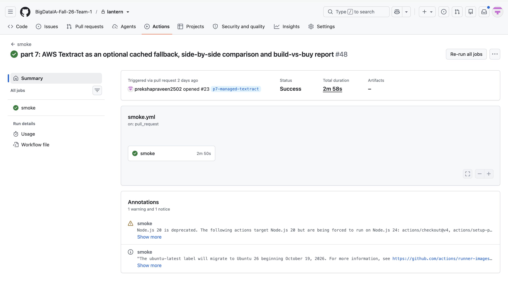

### Results

On a fresh clone of `main`:

- `dvc pull` fetched every data folder with no errors.
- `dvc repro` skipped every stage and pointer file: a second run with no changes skips everything, as the brief requires.
- `dvc metrics show` read `reports/metrics.json`, and `pytest -q` passed 65 tests.

<aside class="negative">
A lesson from building this: our <code>.gitignore</code> used <code>data/*</code> with <code>!data/*.dvc</code>. Git read it correctly, but DVC's own Git library treated the whole <code>data/</code> folder as ignored, so a plain <code>dvc pull</code> silently skipped <code>data/managed</code>, the first standalone pointer file. Listing each data folder explicitly (<code>/data/raw/</code>, <code>/data/managed/</code> …) fixed it, verified on a fresh clone.
</aside>

## Part 9: Evaluation and regression tests
Duration: 0:08:00

The `evaluate` stage scores every extraction path against a hand-typed answer key.

### Ground truth

**10 pages per filing across the six strata the brief lists (18 distinct pages).** Filing pages are in `data/ground_truth/` (tracked with `data/ground_truth.dvc`); fixture pages are in `tests/fixtures/gt/` (in Git), read directly by the evaluation and by CI.

| Stratum | FY2025 | FY2024 |
|---|---|---|
| Statements | p32 income, p34 balance sheet, p36 cash flows | same pages |
| Notes | p40, p45 | p40, p45 |
| Prose | p5, p20 | p5, p20 |
| Cover | p1 | p1 |
| Multi-column | `multicol.pdf` fixture (shared) | |
| Scanned | `scanned.pdf` fixture, page 1 (shared) | |

The filings contain no multi-column or scanned page, so those strata use the Part 0 fixtures, shared by both filings, as the brief allows. The `parse_fixtures` stage runs every extraction path on them, so they are scored exactly like the filing pages.

**How the pages were made:** typed from the rendered page image, or "html-assisted" (copied from the original HTML filing, a different source from the PDF text layer the parsers read, then corrected against the page image). The method for every page is in `pages.csv`. **No ground truth was made from parser output.** The rules are in `reports/ground_truth_conventions.md`.

**Tables:** the FY2025 income statement and balance sheet (111 cells) were keyed by two people independently. They agreed on 110 of 111 cells (F1 0.991). The one difference, a digit transposition in the 2024 diluted share count (15,048,095 vs 15,408,095), was resolved against the page image: 15,408,095.

### Run it

```bash
dvc repro evaluate
dvc metrics show
```

Both sides of every comparison get the same normalization: Unicode NFKC, curly quotes to straight, dashes to "-", "$" separated, whitespace collapsed, lowercase. **Punctuation is kept**, so a lost sign such as (321) becoming 321 counts as an error. Tables are compared as (row label, year, occurrence) → value, so tables of different shapes are compared fairly.

### Results (18 pages)

| Source | WER | CER | Numeric recall |
|---|---|---|---|
| pdfplumber (with OCR fallback) | **1.91%** | **1.76%** | **99.5%** |
| Docling | 11.71% | 9.72% | 83.2% |
| layout | 12.37% | 10.88% | 96.7% |

WER per stratum:

| Stratum (pages) | pdfplumber | Docling | layout |
|---|---|---|---|
| Statements (6) | **1.67%** | 9.87% | 4.74% |
| Notes (4) | **2.20%** | 2.98% | 6.78% |
| Prose (4) | **0.11%** | 4.05% | 5.37% |
| Cover (2) | **3.74%** | 6.90% | 59.87% |
| Multi-column (1, fixture) | 7.62% | 9.60% | **3.15%** |
| Scanned (1, fixture) | **0.00%** | 100.00% | 22.79% |

Tables (111 double-keyed cells): **F1 1.0** for both the traditional path and Docling.

### Findings

1. **pdfplumber reads text best on five of six strata:** it reads the text layer directly, and its OCR fallback reads the scanned page perfectly.
2. **Multi-column is where layout earns its place:** 3.2% vs pdfplumber's 7.6%. pdfplumber reads straight across the two side-by-side tables and interleaves their rows; layout's column-aware reading order reads the left table, then the right.
3. **Docling cannot read a scanned page in our setup (100% WER):** it runs without OCR, so an image-only page yields no text. This is exactly the case the traditional path's OCR fallback exists for. Docling also misses numbers (numeric recall 83%): Part 11 found one cause, a cash-flow row merged into the table header. Its tables, where it finds them, are exact.
4. **Layout breaks on form-like pages:** 60% WER on the cover, where the Part 3 audit found page-sized low-confidence Table and Figure boxes, and 23% on the scanned page, where each detected block is OCR'd separately, which is less accurate than OCR on the whole page.
5. **OCR scored 0.0 WER on the scanned fixture** (544 words). The image is a clean digital render, so this is a best case for Tesseract, not a typical one.
6. **Evaluation found a Part 4 bug:** Docling's per-page Markdown was shifted by one page (its p32 file held p31). Its WER was 90% until the fix; the numbers above are after it.

### Regression tests

`tests/test_quality.py` runs Parts 1 and 2 on the fixtures, grades them with `evaluate.py`, and compares the results with thresholds in `params.yaml` (`eval.thresholds`): the measured baseline plus a margin.

| Check | Measured | Fails if |
|---|---|---|
| Statement text WER | 2.27% | above 5% |
| Numeric recall | 100% | below 98% |
| Table cell F1 | 1.0 | below 0.98 |
| Scanned (OCR) WER | 0.0% | above 5% |

`pytest -q` passes 65 tests, in CI with no network, DVC data or credentials.

**A failing run, on purpose.** With Part 2's structural guards switched off and lattice tried first (a temporary parameter file, `LANTERN_PARAMS=/tmp/params_broken.yaml`), the extractor fell back to lattice fragments with no year headers. **Table cell F1 fell from 1.0 to 0.0**, and the test failed:

```text
FAILED tests/test_quality.py::test_table_cell_f1 - AssertionError: table cell...
E       AssertionError: table cell F1 0.0000 is below 0.98
1 failed, 2 passed, 1 skipped in 18.73s
```

Both text tests still passed, as they should: the break was in table structure only. Full logs: `reports/evidence/quality_failing_run.txt` and `quality_passing_run.txt`.

### Drift between two pipeline versions

`src/plot_drift.py` writes `reports/plots/drift.png`. The signal is layout block length (words per block), both filings, with Part 3's text-snapping distance at 0 pt and at 15 pt:

| | 0 pt | 15 pt |
|---|---|---|
| Blocks | 1,796 | 1,705 (−5.1%) |
| Blocks under 5 words | 35.0% | 31.6% |
| Median words per block | 8 | 9 |
| Total words kept | 61,375 | 61,423 |

The drop is concentrated in 1- and 2-word blocks: clipped words joining their paragraph instead of standing alone.

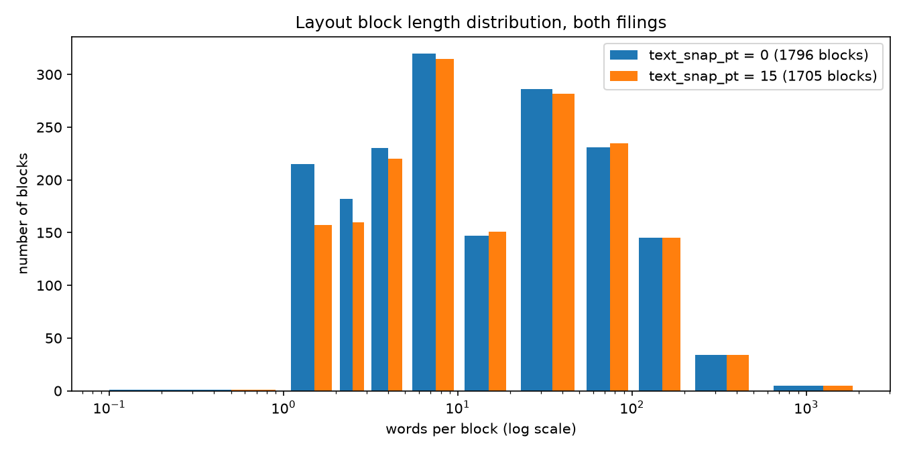

### dvc metrics diff

Moving from 16 filing pages in 4 strata to 18 pages in all 6 strata, `dvc metrics diff main` showed the effect directly (selected rows):

| Metric | Before | After |
|---|---|---|
| `text.pdfplumber.wer` | 0.0167 | 0.0191 |
| `text.docling.wer` | 0.0632 | 0.1171 |
| `text.docling.numeric_recall` | 0.8743 | 0.8318 |
| `text.layout.numeric_recall` | 0.9948 | 0.9667 |
| `text.*.pages` | 16 | 18 |

The full output, including the new `multicolumn` and `scanned` keys, is in `reports/eval.md`.

### Challenges

| Problem | Fix |
|---|---|
| Docling's per-page files shifted by one page (90% WER) | fixed in `docling_parse.py` and its stage rerun |
| Four pages listed twice in `pages.csv` (20 instead of 16) | file rewritten; the averages had been double-weighted |
| A page file named `p036` instead of `p0036` | renamed; it had been silently skipped |
| Fixture strata scored only in CI, pdfplumber only | the new `parse_fixtures` stage runs all three paths on the fixtures |

<aside class="negative">
Limits: 16 filing pages and two fixtures, with only two tables double-keyed. The multi-column and scanned strata have one page each, from fixtures, and the scan is a clean render. Docling runs without OCR here; with OCR enabled its scanned score would change.
</aside>

## Part 10: Cost and throughput
Duration: 0:06:00

`src/bench.py` times the pipeline's own functions on all 61 pages of the FY2025 filing (within the brief's 50 to 100), and writes one CSV per stage to `data/bench/` (tracked with `data/bench.dvc`).

### Machine

Intel Core 7 150U (10 cores, 12 threads), 15.7 GiB RAM, no GPU, Windows, Python 3.11.2 (from `data/bench/machine.json`). Each stage ran in its own fresh process, on mains power with other heavy applications closed.

### Run it

```bash
python src/bench.py --machine
python src/bench.py --stage parse_pdfplumber
python src/bench.py --stage layout --run 1
python src/bench.py --summarize
```

### Per-stage throughput

| Stage | Pages | s/page p50 | s/page p95 | Peak RSS MiB | Failures |
|---|---|---|---|---|---|
| parse_pdfplumber | 61 | 0.096 | 0.233 | 513 | 0 |
| ocr_tesseract (forced on every page) | 61 | 1.505 | 2.895 | 85 | 0 |
| tables (statement pages) | 5 | 0.210 | 0.798 | 537 | 0 |
| layout, full stage | 61 | 0.58 | 3.19 | n/a | 0 |
| parse_docling | 61 | 4.517 | 19.215 | 3,597 | 0 |
| export | 61 | 0.005 | 0.005 | 105 | 0 |

No real page triggers OCR, so OCR was forced on every page to measure what a scanned filing would cost. Tesseract runs as a separate program, so its own memory is not in Python's RSS.

**Cold vs warm.** Model loading takes 7.5 s (layout) and 9.2 s (Docling) on a first run, and less than half that on a second run, when the weights are in the operating system's file cache. A long-running worker pays it once.

### Cost

Assumptions: an m7i-flex.large (2 vCPU, 8 GiB) at $0.09576/hour (AWS on-demand, US East Ohio, checked 2026-10-08), assumed about as fast as the benchmark laptop; 5,000 filings a year × 60.5 pages = 302,500 pages; engineering time not included.

| Path | s/page | USD per 1,000 pages | USD per year |
|---|---|---|---|
| Traditional, p50 | 0.70 | 0.019 | 5.63 |
| Traditional, p95 | 3.49 | 0.093 | 28.08 |
| Traditional + OCR on every page, p50 | 2.21 | 0.059 | 17.74 |
| Docling, p50 | 4.52 | 0.120 | 36.35 |
| Docling, p95 | 19.22 | 0.511 | 154.62 |
| **Textract, Tables + Layout (list price)** | n/a | **15.00** | **4,537.50** |

Even the most pessimistic open-source figure is about 29× cheaper than Textract, and the traditional path at the median about 800× cheaper.

### Bottlenecks and recommendations

- **On the traditional path, `layout` is the bottleneck:** 83% of the median time per page, a little more than half of it Camelot and routing around the model.
- **Docling is the bottleneck of the whole pipeline:** 4.5 s/page at the median, about 6.5× the entire traditional path, concentrated on table-heavy pages.
- **CPU, not GPU.** A g4dn.xlarge (one T4) costs 5.5× more per hour; at our volume Docling on CPU costs $36–155 a year, the most a GPU could save. A GPU was not benchmarked, so no speed-up is claimed.
- **Concurrency:** one worker per vCPU, except Docling, which fits one worker per 8 GiB machine (3.6 GiB peak). Parallelize by filing, and load each model once per worker.
- **EDGAR's 10 requests/second:** about 3 requests per filing, so 5,000 filings need about 25 minutes a year. Download is not a bottleneck, but all workers must share one rate limiter.

Full tables, cold-start figures and limitations are in `reports/benchmarks.md`.

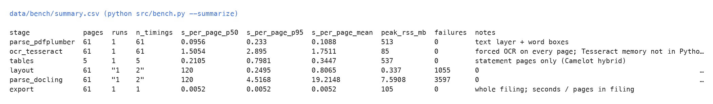

## Part 11: XBRL extraction and validation
Duration: 0:06:00

The filing tells us its own numbers in machine-readable form. The `xbrl` stage uses that as the answer key for every number in the extracted statement tables, for both filings and both table paths.

### What was checked

- **Traditional:** Part 2's normalized tables (`data/tables/*.norm.csv`), already scaled.
- **Docling:** Part 4's table CSVs, scaled with Part 2's normalizer and the page caption.
- **Statements:** income, comprehensive income, balance sheet, cash flows. The statement of shareholders' equity is out of scope: it is a grid of equity components tagged with dimensions, not a label-by-year table.

`src/xbrl.py` loads each unpacked iXBRL filing with **Arelle**. iXBRL tags the same fact wherever it is printed, so duplicates (same concept, dimensions, period, unit and value) are dropped: 957 and 962 tagged numeric facts become **875 unique facts per filing**. Arelle reports a period ending September 27 as midnight on September 28, so one day is subtracted from every end date before matching.

### Method

**Label to concept**, in order, with the method recorded for every line:

1. **Curated** (`config/label_map.yaml`, 27 entries): dimensional lines (Products and Services are slices of a total), labels printed twice, and the cases diagnosed below.
2. **Label linkbase:** the filing's own labels, all roles.
3. **Fuzzy:** a close spelling match (`xbrl.fuzzy_cutoff: 0.88`).

Ambiguity is resolved by **period type**: a balance sheet line is a balance at a date (an instant concept), and a flow statement line is a change over the year (a duration concept). Beginning and ending cash inside the cash-flow statement use the concept's own period type, with beginning balances matched at the prior year end.

**Comparison:** the tolerance comes from the fact's `decimals` (`-6` gives ±0.5 million).

| Status | Meaning |
|---|---|
| `match` | equal within the tolerance |
| `match_negated` | the same amount, printed with a negated label (an outflow in parentheses that XBRL stores as positive) |
| `sign` | the same size, opposite sign |
| `scale_xN` | off by exactly a factor of N |
| `mismatch` | a different value |
| `xbrl_missing` | concept found, but no fact for that period and dimensions |
| `unmapped` | no concept found for the label |
| `pdf_missing` | a fact the other path extracted and validated, missing from this path |

### Run it

```bash
dvc repro xbrl
```

Outputs: `data/xbrl/facts.csv`, `comparison.csv` and `summary.json`, plus `notebooks/xbrl_validation.ipynb`. In `comparison.csv`, `pdf_missing` rows have an empty value field.

### Results

| Statement | Traditional | Docling |
|---|---|---|
| Income | 114 / 114 | 114 / 114 |
| Comprehensive income | 60 / 60 | 60 / 60 |
| Balance sheet | 108 / 108 | 108 / 108 |
| Cash flows | 174 / 174 | 168 / 170 (2 `pdf_missing`) |
| **All** | **456 / 456 (100%)** | **450 / 452 (99.6%)** |

Of the matches, 84 per path are `match_negated` (72 in cash flows, 12 in comprehensive income). **No number on either path is a mismatch, a sign error or a scale error.**

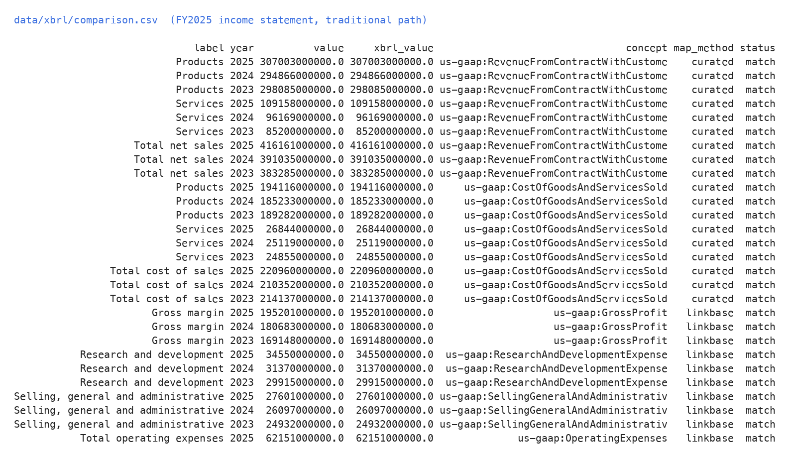

### How we got there

**Run 1, automatic mapping only** (the linkbase and fuzzy tiers, with a minimal curated map; before the de-duplication and the `pdf_missing` status were added):

| | Traditional | Docling |
|---|---|---|
| match | 327 | 327 |
| mismatch / scale error | 0 / 0 | 0 / 0 |
| sign | 3 | 3 |
| xbrl_missing | 12 | 6 |
| unmapped | 114 | 114 |
| **Match rate** | **72%** | **73%** |

Every number that could be mapped was already correct. **The gap was entirely mapping and lookup, not extraction.** Every non-match was diagnosed:

| Cause | Example | Fix |
|---|---|---|
| Same label on a balance concept and a change concept | "Accounts payable": `AccountsPayableCurrent` vs `IncreaseDecreaseInAccountsPayable` | disambiguate by period type |
| Several concepts share a generic label | "Other" (3 lines in cash flows), "Deferred revenue" | curated entries |
| Extension concept changed between filings | derivative lines tagged `aapl:…` in FY2024, `us-gaap:…CashFlowHedge…` in FY2025 | curated entries list both; the one with a fact is used |
| Printed label differs from every filing label | "Total net sales", "Total cost of sales" | curated entries |
| Instant concept inside a flow statement | beginning and ending cash looked up as one-year durations | use the concept's period type, and the prior year end for beginning balances |
| Our own negation logic | R&D flagged `sign` although the values were equal | compare the plain value first; accept the opposite sign only for negated presentations |

**Final run:** after these fixes, every extracted number on both paths matches. The only remaining non-matches are Docling's 2 `pdf_missing` facts.

### Traditional vs Docling

Both paths extracted every number they found correctly. The difference is coverage: **Docling's cash-flow tables lost the first row** ("Cash, cash equivalents, and restricted cash and cash equivalents, beginning balances") in both filings. Its table model merged that row into the column header (`Years ended.September 27, 2025 $ 29,943` in one header cell of `AAPL_10K_20250927_pdf_p0036_t00.csv`), so the row's numbers never became data cells. The traditional path extracted the row in both filings.

**Why 2 `pdf_missing` facts, not 6:** a year's beginning cash is the same XBRL fact as the previous year's ending cash, which Docling did capture. Only the oldest beginning balance in each filing is a fact Docling never extracted anywhere. So Docling lost 6 printed numbers, but 2 distinct facts.

<aside class="negative">
Limits: the curated map was built by diagnosing these two filings, so a new company or year would need the same diagnosis (the automatic tiers carried 73% of numbers on their own here). The statement of shareholders' equity and the note tables are not validated.
</aside>

## The LANTERN app: browse and trace the corpus
Duration: 0:06:00

The deployed app lets an analyst do in a browser what this Codelab does on the command line: browse every page with its layout blocks, search for a number, and follow it back to its page, bounding box, JSONL record and Markdown line.

**Live:** [http://52.15.107.141:8501/](http://52.15.107.141:8501/)

### How it is built

| Part | Code | What it does |
|---|---|---|
| **Backend** | `app/api/main.py` (FastAPI) | A read-only API over the pipeline's outputs: `data/export` (the JSONL records and Markdown), `data/rendered` (the PDFs, rendered to page images on request) and `reports/`. It runs no pipeline stages. It listens only on `127.0.0.1:8000`, so it is not reachable from outside the server. |
| **UI** | `app/ui/` (Streamlit) | Five pages that call the API. `lantern_api.py` is the shared client: API calls, the bbox overlay drawn on page images (bboxes are in PDF points, so they are scaled by DPI ÷ 72), and the zoomed crop around a block. |

The API's endpoints are `/filings`, `/filings/{stem}/pages/{page}/records` and `/image`, `/filings/{stem}/tables`, `/filings/{stem}/records/{block_id}` (one record with its Markdown excerpt), `/search` and `/reports`.

### The pages

| Page | What an analyst can do |
|---|---|
| **Home** | See both filings: accession, form, period, page and record counts, the block types extracted, and the manifest. |
| **Explorer** | Pick a filing and a page, see the rendered page with every layout block drawn in its type's color, filter by block type, and highlight one block to see its full JSONL record. |
| **Trace a fact** | Search any phrase or value across text and table cells (for example "net income"), pick a hit, and follow it end to end: the block zoomed and highlighted on the rendered page, its JSONL record, and its Markdown excerpt with the `<!-- doc_id page block_id -->` provenance comment. Each statement line's XBRL status is in the Reports page (`xbrl.md`). |
| **Tables** | Browse every extracted table: normalized values in full units next to the raw cell strings from the PDF, the extractor and the scale applied, with a CSV download. |
| **Reports** | Read every report and evidence file, grouped by Part: Markdown rendered, CSVs as tables, JSON and plots shown in place. |

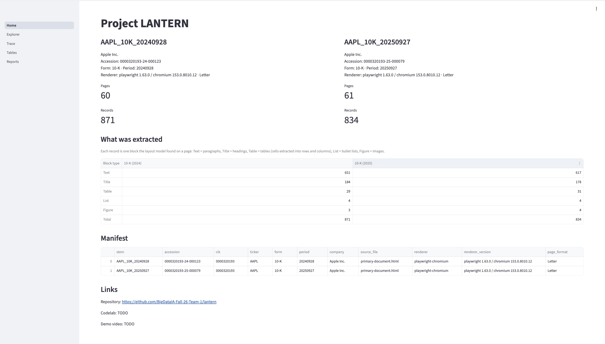

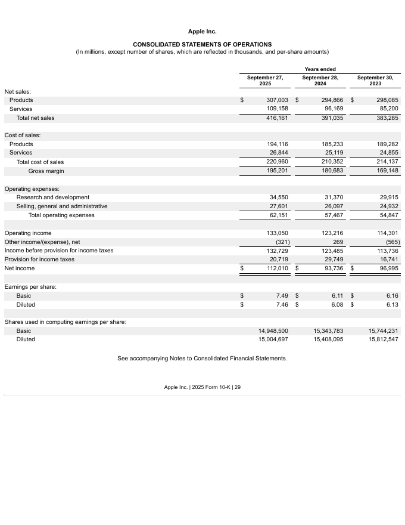

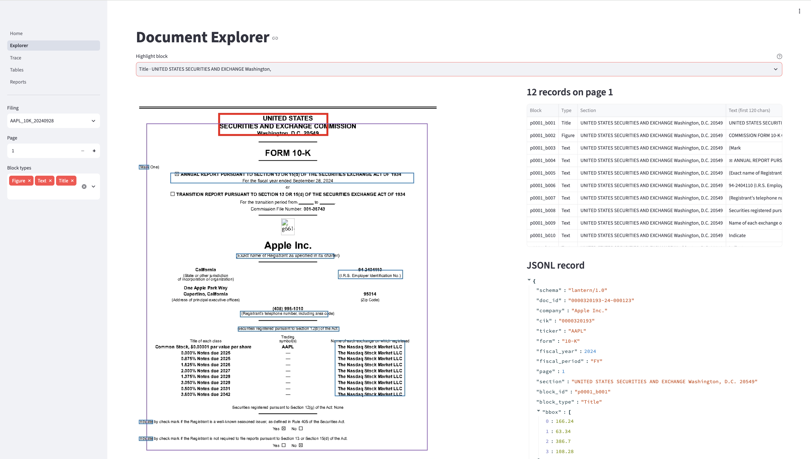

### Run it locally

From the repo root, after `dvc pull`:

```bash
pip install -r app/requirements-app.txt
uvicorn app.api.main:app --port 8000
```

Then, in a second terminal:

```bash
LANTERN_API=http://127.0.0.1:8000 streamlit run app/ui/Home.py
```

Open `http://localhost:8501`.

### How it is deployed

| | |
|---|---|
| **Server** | AWS EC2 `t3.small`, `us-east-2a`, Ubuntu 24.04. The app only reads finished outputs and renders page images, so a small instance is enough: no parsing model runs on it. |
| **Setup** (`deploy/setup.sh`, once) | Installs Python 3.11, creates a venv, installs `app/requirements-app.txt`, pulls only the data the app needs (`dvc pull data/export data/rendered`, from the public remote, with no credentials), and installs and starts two systemd services. |
| **Services** (`deploy/*.service`) | `lantern-api` runs uvicorn on `127.0.0.1:8000`; `lantern-ui` runs Streamlit on port 8501, open to the internet. Both are enabled at boot and restart automatically (`Restart=always`). |
| **Updates** (`deploy/update.sh`) | After updating the code on the server: reinstalls the requirements, pulls the data again and restarts both services, then prints the deployed commit. |

<aside class="positive">
The server never needs AWS keys: it reads the corpus from the same public DVC remote graders use, and the API exposes the outputs read-only.
</aside>

## Summary and recommendations
Duration: 0:03:00

**Primary parsing path (Part 4).** Keep the traditional pipeline (pdfplumber text, the Camelot hybrid extractor, LayoutParser routing) as the primary path. On 18 ground-truth pages it has the lowest text error (WER 1.91% vs 11.71% for Docling) and the highest numeric recall (99.5% vs 83.2%), it matched XBRL on all 456 statement numbers (Docling 450 of 452), and its OCR fallback reads scanned pages. Use Docling as the cross-check of the statements, where both paths agree cell for cell, and for form-like pages such as the cover.

**Formats (Part 6).** JSONL is the source of truth: it keeps every field, including the page, bbox and raw and normalized cells, that validation and citation need. Markdown feeds Case Study 2: it answered retrieval questions as accurately as JSONL at about a fifth of the tokens, and every block keeps a provenance comment that leads back to its JSONL record.

**Build vs buy (Parts 7 and 10).** AWS Textract matched the open-source pipeline number for number on every page compared, and at list price it costs about $4,540 a year for 5,000 filings, against $6 to $155 a year of compute for the open-source paths. Keep it as an off-by-default, cached fallback, triggered by a validation failure rather than sent every page.

**The app.** The deployed Streamlit app puts the corpus in an analyst's browser: any number can be searched and followed to its page, bounding box, JSONL record and Markdown line.

**Reproducibility (Part 8).** A fresh clone rebuilds everything with `dvc pull` and `dvc repro`, with no credentials, and every number in this Codelab traces back to a file in `reports/` or `data/`.

### Links

- Repository: [github.com/BigDataIA-Fall-26-Team-1/lantern](https://github.com/BigDataIA-Fall-26-Team-1/lantern)
- Deployed app: [http://52.15.107.141:8501/](http://52.15.107.141:8501/)
